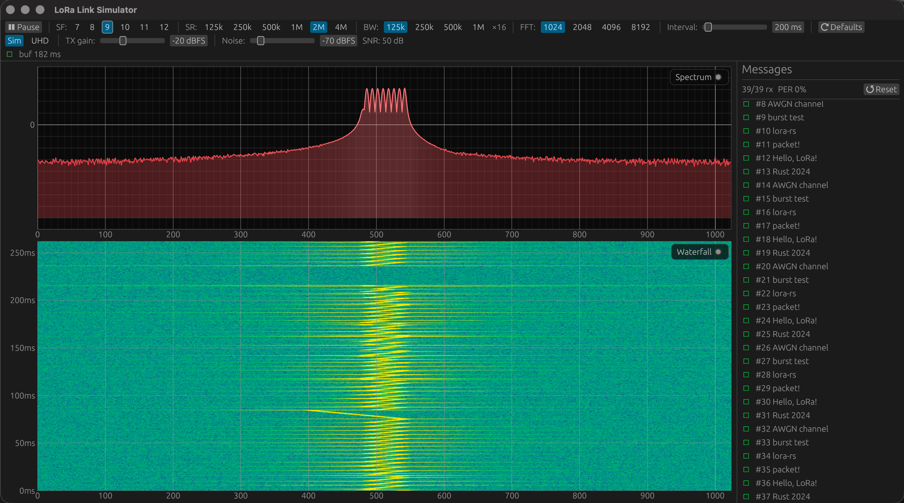

# lora-rs

A LoRa modulation/demodulation library and real-time link simulator written in Rust.

Implements the full LoRa PHY pipeline — whitening, explicit header, CRC-16, Hamming FEC, interleaving, gray coding, chirp up/down modulation — and runs it as a live GUI with a spectrum analyzer, time-calibrated waterfall, and a scrolling decode log. Optionally drives real USRP hardware via UHD.

## Screenshot



The spectrum (top) shows the LoRa chirp signal sitting above the noise floor. The waterfall (bottom) scrolls at true signal-time, with Y-axis labels showing how far back in time each row is. The yellow band is a decoded LoRa packet; the right panel lists each decoded payload with sequence numbers and channel estimates.

## Features

- **Full LoRa PHY**: whitening → explicit header → CRC-16 → Hamming(4,8) FEC → diagonal interleaving → gray coding → chirp modulation, and the exact reverse on RX
- **Live spectrum & waterfall**: Hann-windowed FFT with peak-hold spectrum; waterfall Y-axis labeled in real signal time (ms / s)
- **Sim mode**: continuous TX → AWGN channel → RX loop with adjustable signal and noise levels; sequence-numbered packets for automatic PER measurement
- **UHD mode**: switch to a real USRP at runtime — same GUI, same controls, live RF
- **Headless / CI mode**: non-GUI batch runner prints per-packet results and a PER summary line

## Running

### GUI simulator

```bash
cargo run --bin gui_sim [sf]
```

`sf` is the spreading factor (7–12, default 7). All other parameters are adjustable at runtime.

### Headless / CLI

```bash
cargo run --bin gui_sim -- --cli [sf] [snr_db] [packets]
```

Example — 20 packets at SF9, SNR 5 dB:

```bash
cargo run --bin gui_sim -- --cli 9 5 20
```

Prints per-packet results and a summary with packet error rate.

## Building

```bash
cargo build --bin gui_sim
```

To build **without** USRP hardware support (no UHD dependency):

```bash
cargo build --bin gui_sim --no-default-features
```

The `uhd` feature (on by default) compiles a C glue layer and links against libuhd. It expects UHD installed under `/opt/homebrew` (macOS via Homebrew). On Linux, adjust `build.rs` to point at your UHD prefix.

## GUI controls

| Control | Description |
|---------|-------------|
| **⏸ / ▶** | Pause / resume the simulation |
| **SF** | Spreading factor 7–12 |
| **SR** | Sample rate: 125k – 4M kHz |
| **BW** | Signal bandwidth: 125k – 1M kHz |
| **FFT** | FFT window size: 1024 – 8192 |
| **Interval** | TX packet interval (0–5000 ms) |
| **TX gain** | Signal amplitude in dBFS (sim) or dB (UHD) |
| **Noise** | AWGN noise floor in dBFS (sim only) |
| **SNR** | Live readout of signal − noise (sim only) |
| **Sim / UHD** | Switch between simulated channel and real hardware |
| **⟳ Defaults** | Reset all parameters to defaults |

## Default simulation parameters

| Parameter | Default | Options |
|-----------|---------|---------|
| Spreading factor | SF7 | 7 – 12 |
| Sample rate | 1 MHz | 125k / 250k / 500k / 1M / 2M / 4M |
| Bandwidth | 250 kHz | 125k / 250k / 500k / 1M |
| FFT size | 1024 | 1024 / 2048 / 4096 / 8192 |
| Signal level | −20 dBFS | |
| Noise level | −60 dBFS | |
| Packet interval | 500 ms | |

## Architecture

```
TX  ──►  Channel (AWGN)  ──►  RX
              │
              └──►  Display (FFT ──► waterfall / spectrum)
```

### Library (`src/`)

| Module | Purpose |
|--------|---------|
| `tx/` | Modulation pipeline (whitening → header → CRC → Hamming → interleave → gray → chirp) |
| `rx/` | Demodulation pipeline (frame sync → FFT demod → gray → deinterleave → Hamming → CRC → dewhiten) |
| `ui/` | egui plot widgets: `SpectrumPlot`, `WaterfallPlot`, `Chart` |
| `tables/` | Whitening sequence lookup table |

### Simulator (`src/bin/gui_sim/`)

| Module | Purpose |
|--------|---------|
| `sim.rs` | Main loop — drives TX → driver → RX → display pipeline |
| `tx.rs` | TX worker thread |
| `rx.rs` | RX worker thread with frame-sync buffer |
| `channel.rs` | Simulated AWGN channel (streaming, per-sample) |
| `display.rs` | Hann-windowed FFT worker, peak-hold spectrum, waterfall |
| `driver.rs` | `Driver` trait — abstracts sim channel vs. real hardware |
| `uhd_device.rs` | USRP hardware device (UHD feature) |
| `gui.rs` | egui/eframe application |
| `headless.rs` | CLI runner |
| `shared.rs` | `SimShared` — thread-safe state shared across all workers |
